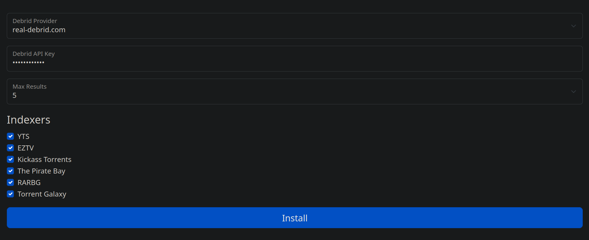

# Annatar - Lord of Gifts


The fastest just-in-time torrent/debrid search add-on for [Stremio](https://www.stremio.com/) providing results in under 3s.

Annatar searches torrent and debrid sites for cached content to provide instantly available content for Stremio. Results from Annatar typically arrive in **3s or less**. Annatar achieves its speed by using several fanout queries and map-reduce functions to gather the fastest and most accurate results using Jackett APIs. 

I created this plugin because I wanted a self-hosted alternative to Torrentio. 

## The Fastest

There are other plugins that are similar to Annatar, but my experience with them has been not great. Results typically take over 10s which is far from ideal. Annatar is fast enough that the short delay does not bother me. Content is cached using [redislite](https://redislite.readthedocs.io/en/latest/). This includes debrid links, Torrent metadata, and Jackett search results. 

Cache is built based on user-requests. Each new imdb id will be cold requested from Jackett, Cinemeta, and Debrid. Subsequent requests will retrieve cache (given some TTLs depending on arbitrary logic).

## Running Locally

:warning: It is important to note that the indexers you choose to search are what determines the cold speed of Annatar results. Those listed in the image below are the ones that I have had the best experience with and also provide results for almost everything I search. choose your indexers carefully. If you aren't sure which ones are fast/slow then add one and use the Manual Search button in Jackett and set the indexer in the query. If the results take forever then that's a slow indexer. :warning: 

**Annatar must be accessible by Stremio via HTTPS**. Run it on a desktop, VM, or server somewhere that your Stremio apps can reach it. You will need HTTPS otherwise Stremio will not install the plugin. See #1 for comments. 

Annatar does not import certificates. You will likely need a reverse proxy such as nginx or Caddy. See #1 comments for an nginx example.

 ### If You Already Have Jackett

```
docker run -d -p 8000:8000 -v ./annatar-data:/app/data --name annatar \
	-e JACKETT_URL=<your jackett URL> \
	-e JACKETT_API_KEY=<your jackett api key> \
	-e JACKETT_INDEXERS=eztv,kickasstorrents-ws,thepiratebay,therarbg,torrentgalaxy,yts \
	registry.gitlab.com/stremio-add-ons/annatar:latest
```

### If you don't already have Jackett

```bash
# create a working directory
mkdir -p annatar
cd annatar
# Download the docker-compose
curl -LJO https://gitlab.com/stremio-add-ons/annatar/-/raw/master/docker-compose.yaml
docker-compose up -d jackett
```

Open http://localhost:9117 and add some indexers. I recommend the ones pictured below for almost all TV and Movies. They are the fastest providers. If someone wants to suggest others open a PR (i.e. anime indexers). 


Edit `docker-compose.yaml` and paste your API key under `annatar -> env -> JACKETT_API_KEY`

Run Annatar. `docker-compose up -d`

Install the add-on to Stremio:

1. Open `http://<host>:8000/configure` on a machine that has Stremio installed

2. Type in your details and click Install

   

3. This will launch the plugin the Stremio app. 

## This is not Torrentio

Torrentio provides instant results because it uses a crawler to cache content from indexers. All searches against the Torrentio add-on yield results from cached content. While this provides instant results it comes at a cost. Sometimes that [cost is downtime](https://www.reddit.com/r/StremioAddons/comments/1acl7ss/torrentio_faq/), but it also means that Torrentio caches much more than I need or care to know about. Also, because of this added complexity it is [non-trivial](https://github.com/Gabisonfire/knightcrawler) to self-host Torrentio. 

This plugin is implemented in python using the [Stremio protocol definition](https://github.com/Stremio/stremio-addon-sdk/blob/master/docs/protocol.md).

---

**<u>DISCLAIMER</u>**: *This software does not interact with torrent protocols, nor does it download or stream any content whatsoever. It is a Stremio plugin that provides only metadata and links by searching torrent indexers for content and searching Debrid services. Interacting with torrent indexers may be illegal in your country.* 
